# CloudSyncPro

Cloud file storage and team collaboration platform — inspired by Google Drive and Dropbox. Built with React + Vite + TypeScript, Supabase, and Cloudflare R2.

## Screenshots

### Dashboard

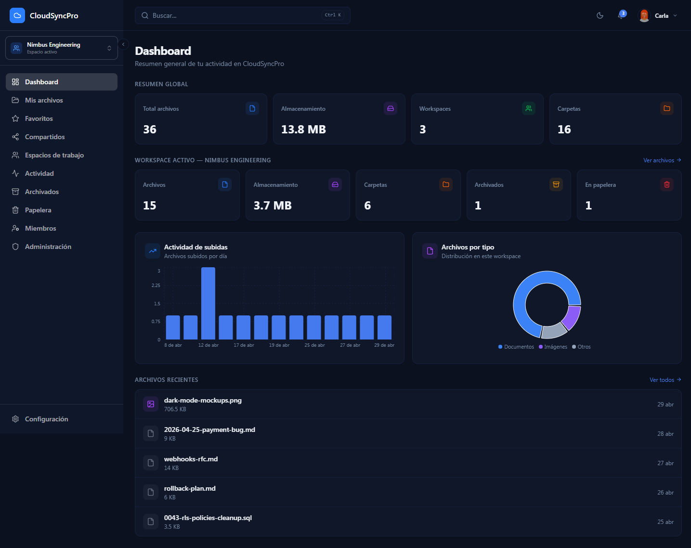

### Files

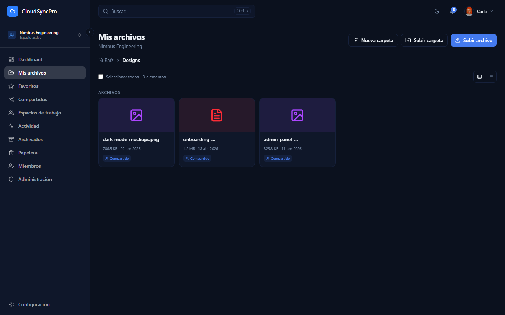

### Activity timeline

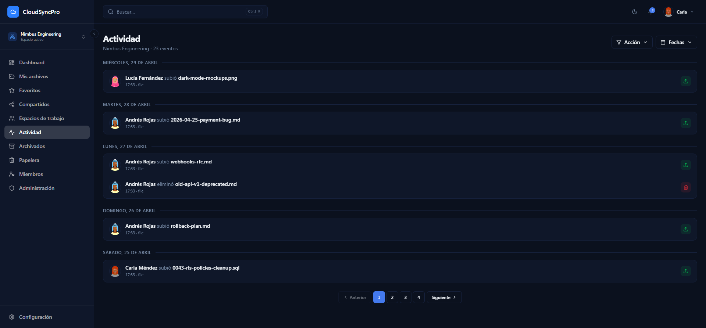

### Members & roles

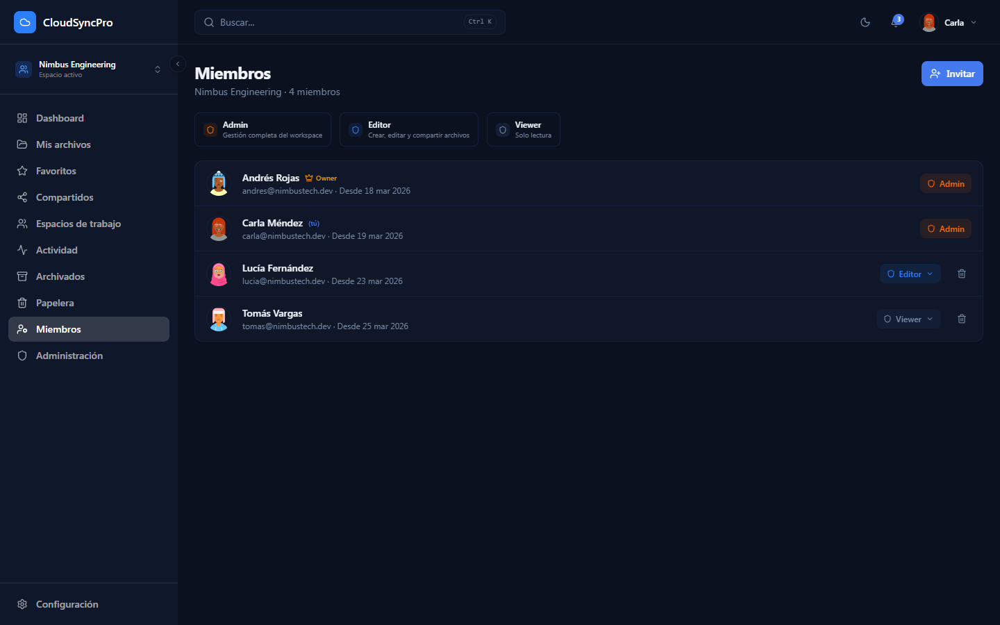

### Admin panel

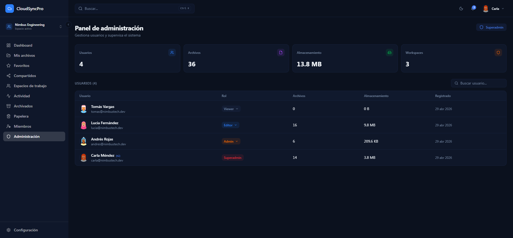

### Auth

| Login | Register |
|---|---|
| 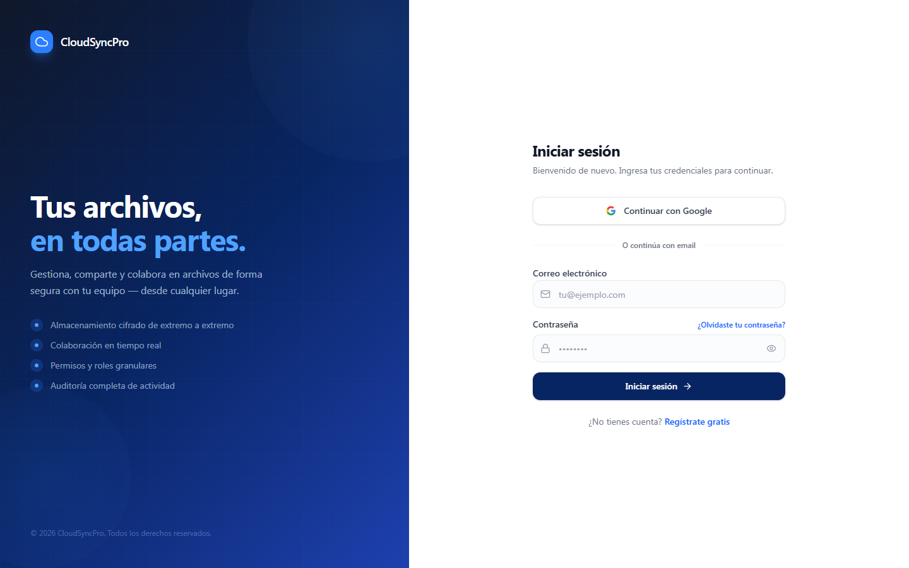 | 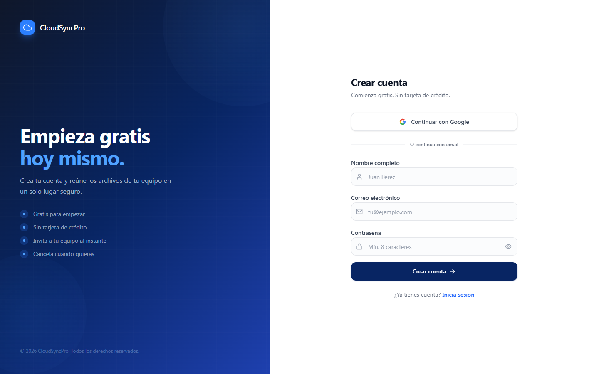 |

### Mobile responsive

| Dashboard | Files | Sidebar drawer | Members |
|---|---|---|---|
| 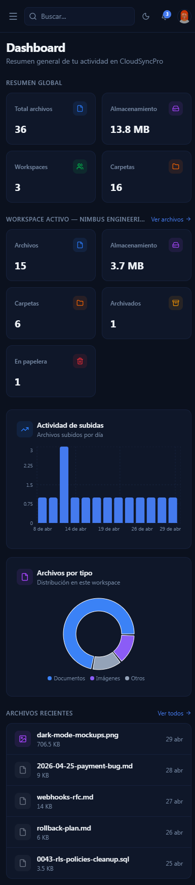 | 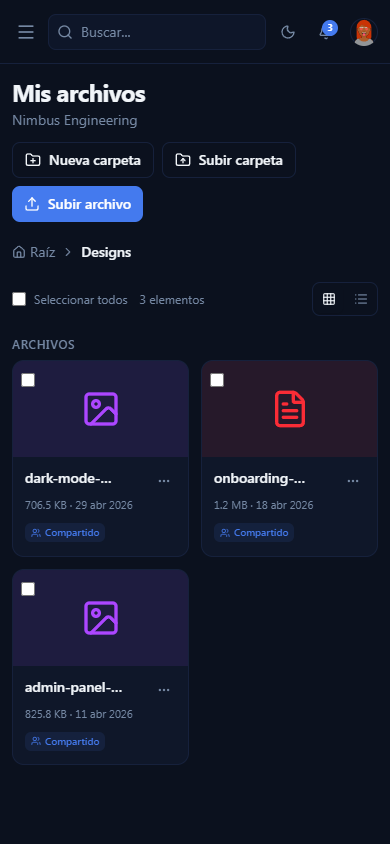 | 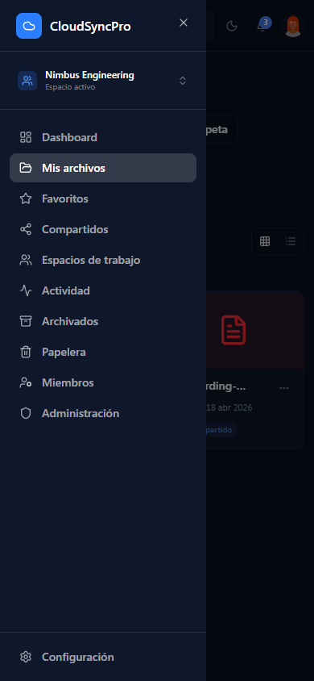 | 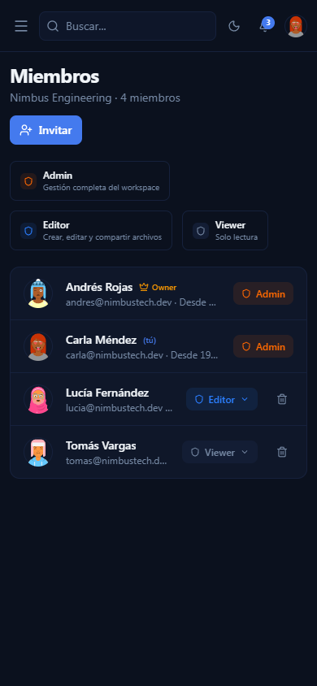 |

<details>
<summary>More screenshots</summary>

| Workspaces | Shared | Trash | Archived |
|---|---|---|---|
| 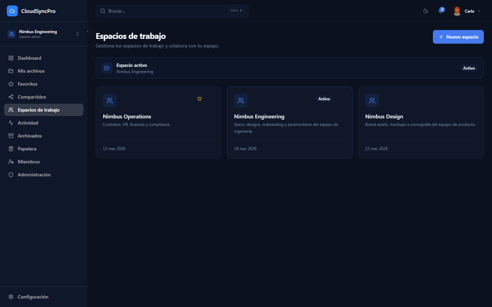 | 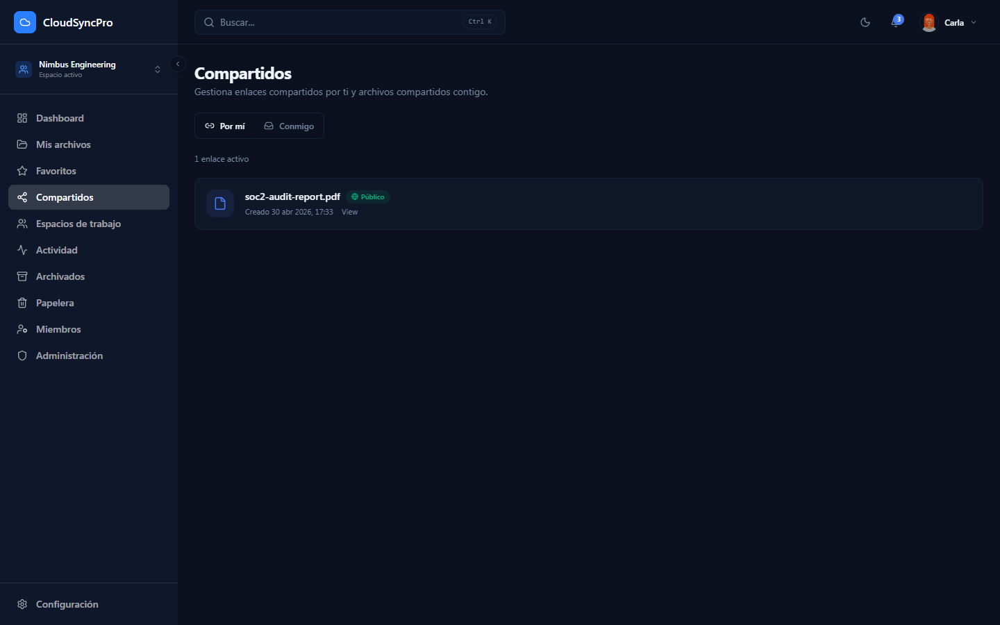 | 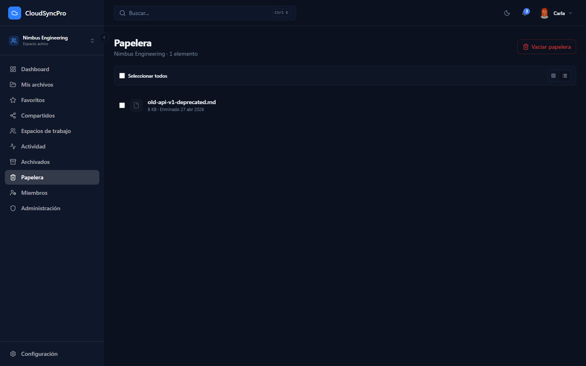 | 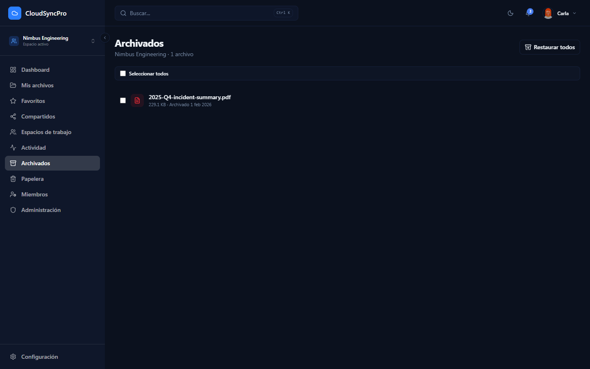 |

| Profile | Notifications | 404 |
|---|---|---|
| 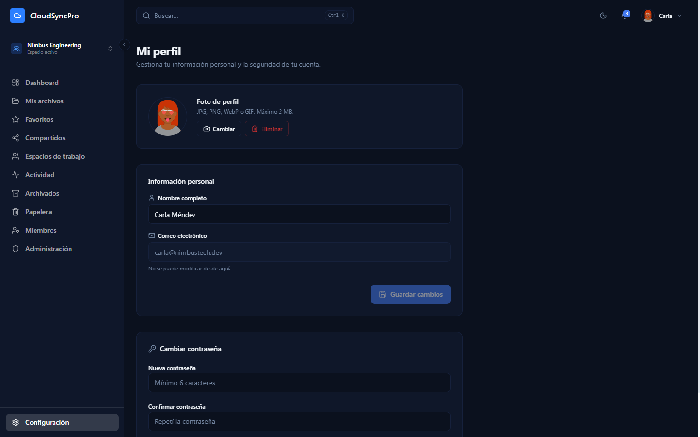 | 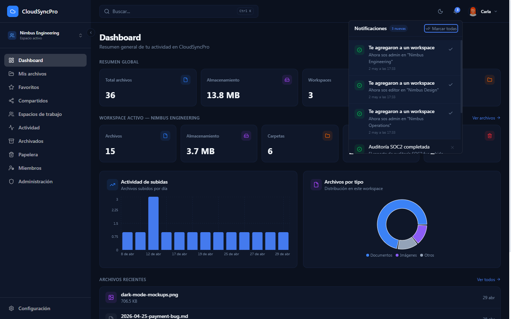 |  |

</details>

## Stack

| Layer | Technology |
|---|---|
| Frontend | Vite, React 19, TypeScript |
| Styling | Tailwind CSS v4, shadcn/ui (radix-ui) |
| Client state | Zustand (with persist) |
| Server state | TanStack Query v5 |
| Routing | React Router v7 |
| Backend | Supabase (Auth + Postgres + Edge Functions + Realtime) |
| Storage | Cloudflare R2 |
| Charts | Recharts |
| Notifications | Sonner |
| Icons | Lucide React |

## Features

- **Auth**: email/password + Google OAuth + password recovery
- **Workspaces**: multiple per user with members and roles (`superadmin`, `admin`, `editor`, `viewer`)
- **Files**: hierarchical folders, drag & drop upload/move, image and PDF preview
- **Sharing**: public links with optional expiration + direct sharing to other users
- **Trash**: with automatic 30-day TTL (Supabase cron)
- **Archive**: separate from trash, no TTL
- **Favorites**: quick mark for files/folders
- **Activity log**: per-workspace with filters (action, date range)
- **Notifications**: in-app via Supabase Realtime
- **Admin panel**: user management and global stats (superadmin/admin only)
- **Global search**: files and folders via Ctrl+K
- **Dark mode**: light, dark, and system (reactive to OS changes)
- **Mobile responsive**: 320px+ with sidebar drawer and compact header
- **Classic pagination**: 6 items per page on all long lists
- **404 page**, **error boundary**, **offline detection**, **lazy-loaded routes**

## Requirements

- Node.js ≥ 20
- A Supabase project ([supabase.com](https://supabase.com)) — free tier works for development
- A Cloudflare account with R2 enabled ([cloudflare.com](https://cloudflare.com))

## Local setup

```bash
git clone <your-repo>.git cloudsyncpro
cd cloudsyncpro
npm install

# Copy env vars and fill in your credentials
cp .env.example .env.local
# Edit .env.local

npm run dev
```

Open `http://localhost:5173`.

## Environment variables

Variables prefixed with `VITE_` are exposed to the browser. The rest are **server-side only** (set them in Supabase Dashboard → Edge Functions → Secrets, not in `.env.local` for production).

### Client

| Variable | Purpose |
|---|---|
| `VITE_SUPABASE_URL` | Supabase project URL |
| `VITE_SUPABASE_ANON_KEY` | Anonymous key (safe for frontend) |
| `VITE_R2_PUBLIC_URL` | Public URL of the R2 bucket (custom domain or `pub.r2.dev`) |

### Server (Edge Functions)

| Variable | Purpose |
|---|---|
| `SUPABASE_SERVICE_ROLE_KEY` | Admin key (server-side only — never expose to frontend) |
| `R2_ENDPOINT` | S3-compatible R2 endpoint |
| `R2_ACCESS_KEY_ID` | R2 access key |
| `R2_SECRET_ACCESS_KEY` | R2 secret key |
| `R2_BUCKET_NAME` | Bucket name |
| `CRON_SECRET` | Shared secret for the auto-purge cron |

See `.env.example` for details.

## Scripts

| Command | Description |
|---|---|
| `npm run dev` | Dev server at `localhost:5173` |
| `npm run build` | Production build (typecheck + bundle) |
| `npm run preview` | Serve the build locally at `localhost:4173` |
| `npm run lint` | Run ESLint over the project |
| `npm run gen:types` | Regenerate TS types from the Supabase schema |

## Project structure

```
src/
├── components/
│   ├── layout/         # AppShell, Header, Sidebar
│   ├── shared/         # Reusable modals, dialogs, dropdowns
│   ├── ui/             # shadcn primitives (Button, Dialog, ...)
│   └── ErrorBoundary.tsx
├── hooks/              # Custom hooks (useAuth, useFiles, useTheme, ...)
├── lib/                # External clients (supabase, queryClient)
├── pages/              # One folder per area (auth, dashboard, files, ...)
├── routes/             # AppRouter with lazy loading
├── services/           # Supabase / R2 calls (business logic)
├── store/              # Zustand stores (authStore, uiStore, workspaceStore)
├── types/              # TS types (databaseTypes generated, authTypes manual)
└── utils/              # Helpers (validation, fileUtils, folderColors, ...)

public/
├── favicon.svg
├── manifest.webmanifest
├── robots.txt
└── sitemap.xml

supabase/
└── functions/          # Edge Functions: upload-file, delete-account, purge-files
```

## Architecture

```
┌─────────────┐         ┌─────────────────┐
│   Browser   │ ──────► │   Vite (SPA)    │
└──────┬──────┘         └────────┬────────┘
       │                          │
       │  Supabase JS             │ static assets
       │  (auth + queries)        │ from /dist
       ▼                          ▼
┌─────────────────────────────────────────┐
│               Supabase                  │
│  ┌──────┐  ┌────────┐  ┌──────────────┐ │
│  │ Auth │  │Postgres│  │Edge Functions│ │
│  │      │  │ + RLS  │  │              │ │
│  └──────┘  └────────┘  └──────┬───────┘ │
└────────────────────────────────┼────────┘
                                 │  upload, delete, purge
                                 ▼
                       ┌──────────────────┐
                       │   Cloudflare R2  │
                       │  (object store)  │
                       └──────────────────┘
```

### Upload flow

1. Client requests a presigned URL from the `upload-file` Edge Function
2. Edge Function validates permissions (RLS) and returns an R2 presigned URL
3. Client uploads directly to R2 (bypasses Supabase, saves bandwidth)
4. Client registers the file in Postgres

### Auto-purge flow

- pg_cron job runs daily at 03:15 UTC
- Calls the `purge-files` Edge Function with `mode: auto_purge` and `X-Cron-Secret`
- The function deletes from R2 + Postgres any trashed files with `updated_at` older than 30 days

## Production deployment

### Frontend → Vercel

1. Connect the repo to Vercel
2. Framework preset: **Vite**
3. Under **Settings → Environment Variables** add `VITE_SUPABASE_URL`, `VITE_SUPABASE_ANON_KEY`, `VITE_R2_PUBLIC_URL`
4. `vercel.json` already includes SPA rewrites + security headers (HSTS, X-Frame, Permissions-Policy)

### Supabase

- **Authentication → URL Configuration**: add your prod domain to Site URL and Redirect URLs
- **Authentication → Email Templates**: customized in Spanish (Confirm signup, Reset password, etc.)
- **Edge Functions → Secrets**: `SUPABASE_SERVICE_ROLE_KEY`, `R2_*`, `CRON_SECRET`

### Google OAuth

- Google Cloud Console → APIs & Services → Credentials
- Add `https://<project>.supabase.co/auth/v1/callback` as authorized redirect URI
- Add `https://your-domain.com` as authorized origin

### Cloudflare R2

- Bucket → Settings → CORS Policy: add `https://your-domain.com` to `AllowedOrigins`

## Conventions

- **Languages**: UI copy is in Spanish, commit messages are in English
- **Commits**: conventional style (`feat:`, `fix:`, `perf:`, `chore:`, `docs:`)
- **Branches**: `main` is production
- **Code**: variable/function names in English (technical convention)
- **Tailwind**: responsive prefixes (`sm:`, `md:`, `lg:`) — `lg:` corresponds to the fixed sidebar on desktop

## Applied optimizations

- **Bundle splitting**: `recharts` and `date-fns` in separate chunks (DashboardPage 109 KB → 2.8 KB gzip)
- **Lazy loading**: each route is loaded on demand
- **DB indexes**: composite indexes for queries by `workspace_id + status + created_at`
- **Avatar cleanup**: the old avatar is deleted automatically when a new one is uploaded (no R2 orphans)
- **Inline splash**: CSS-only spinner in `index.html` for faster perceived FCP
- **A11y**: 100/100 Lighthouse on login (contrast, touch targets, landmarks)
- **SEO**: 100/100 (robots.txt, sitemap, OG/Twitter meta, dynamic page titles)
